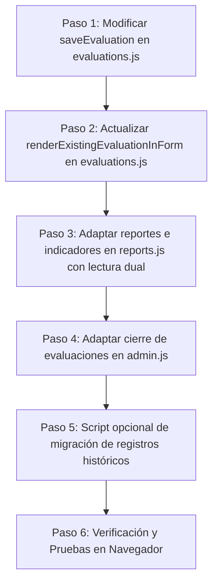

# Plan de Cambio: Enriquecimiento del Campo `evaluacion` con Textos Históricos de Competencias y Aspectos

## Contexto y Objetivo
Actualmente, la tabla `evaluacion` de Supabase almacena en el campo de texto JSON `evaluacion` únicamente:
```json
{
  "trabajador_id": 1201,
  "valor": "3"
}
```
Y delega la relación con la competencia y el aspecto a las columnas relacionales `clase_id` e `item_evaluacion_id`.

El objetivo es cambiar/enriquecer la información grabada en el campo `evaluacion` para que guarde directamente los valores descriptivos (**nombre/título de la clase**, **descripción de la clase** y **descripción del ítem de evaluación**). Esto otorga **inmutabilidad histórica**: si en el futuro se modifica o elimina una competencia o aspecto en los catálogos maestros, las evaluaciones históricas conservarán exactamente los textos con los que fue evaluado el colaborador.

---

## Análisis de Impacto y Riesgos

> [!IMPORTANT]
> **Base de Datos Existente:** La tabla `evaluacion` contiene actualmente **más de 1.000 registros históricos** grabados con el formato minimalista anterior.
> Cualquier cambio en la lectura debe ser **100% retrocompatible** para no romper la visualización de evaluaciones pasadas ni los informes de subordinados/indicadores.

> [!WARNING]
> **Esquema Físico de Supabase:** En la tabla `evaluacion`, las columnas `clase_id` e `item_evaluacion_id` son columnas SQL. Si tienen restricción `NOT NULL` en PostgreSQL, no pueden omitirse en la sentencia `INSERT`/`UPDATE` a menos que se altere la tabla en Supabase.
> Por seguridad y para no romper las llaves foráneas o índices existentes, se recomienda mantener las columnas SQL intactas y almacenar los textos descriptivos dentro del objeto JSON `evaluacion`.

---

## Comparativa de Estructura de Datos

### Formato Actual del JSON `evaluacion`:
```json
{
  "trabajador_id": 1201,
  "valor": "3"
}
```

### Formato Propuesto del JSON `evaluacion`:
```json
{
  "trabajador_id": 1201,
  "valor": "3",
  "clase_nombre": "COMUNICACIÓN",
  "clase_descripcion": "Capacidad para escuchar al otro y tratar de comprenderlo...",
  "item_descripcion": "Expresa sus ideas con claridad y precisión tanto de forma oral como escrita.",
  "clase_id": 18,
  "item_evaluacion_id": 55
}
```
*(Nota: Mantener `clase_id` e `item_evaluacion_id` dentro del JSON o como metadata opcional asegura la compatibilidad con algoritmos de agrupación rápida).*

---

## Plan de Ejecución Paso a Paso



### Paso 1: Modificar la captura y guardado en [js/evaluations.js](file:///c:/xampp/htdocs/eval/eval-desempeno/js/evaluations.js)
* **Ubicación:** Función `saveEvaluation()` (líneas ~406 a 455).
* **Acción:**
  1. Al recorrer cada fila `.aspecto-row`, obtener de la memoria (`state.classesCache` y `state.aspectsCache`) los datos de la competencia y del aspecto correspondientes:
     ```javascript
     const claseObj = state.classesCache.find(c => c.id === claseId);
     const aspectoObj = state.aspectsCache.find(a => a.id === aspectoId);
     ```
  2. Construir el objeto JSON `evaluacion` con los nombres y descripciones:
     ```javascript
     const evaluacionData = {
       trabajador_id: trabajadorId,
       valor: answerValue,
       clase_nombre: claseObj ? claseObj.titulo : '',
       clase_descripcion: claseObj ? (claseObj.descripcion || '') : '',
       item_descripcion: aspectoObj ? aspectoObj.descripcion : ''
     };
     ```
  3. Empaquetar el payload para Supabase:
     ```javascript
     const payload = {
       clase_id: claseId,
       item_evaluacion_id: aspectoId,
       fecha: fecha,
       estado: false,
       evaluacion: JSON.stringify(evaluacionData)
     };
     ```

---

### Paso 2: Adaptar la carga de evaluaciones para edición en [js/evaluations.js](file:///c:/xampp/htdocs/eval/eval-desempeno/js/evaluations.js)
* **Ubicación:** Función `renderExistingEvaluationInForm(existingRows)` (líneas ~310 a 375).
* **Acción:**
  * Al rellenar los campos de una evaluación abierta existente, hacer el emparejamiento con soporte dual:
    * Buscar primero por `item_evaluacion_id`.
    * Si no viene o no coincide, buscar por coincidencia en `item_descripcion`.

---

### Paso 3: Actualizar lectura en Módulo de Reportes e Indicadores en [js/reports.js](file:///c:/xampp/htdocs/eval/eval-desempeno/js/reports.js)
* **Ubicaciones:**
  * `renderIndicadoresGenerales()` (línea ~50)
  * `renderReporteSubordinados()` (línea ~740 y ~805)
  * `printReporteSubordinados()` (línea ~970)
  * `showWorkerChartModal()` (línea ~220)
* **Acción:**
  * Implementar función helper o lectura condicional:
    ```javascript
    // Obtener descripción del aspecto (priorizando la histórica del JSON)
    const itemDesc = parsed.item_descripcion || (aspecto ? aspecto.descripcion : 'Aspecto sin descripción');
    // Obtener nombre de la competencia (priorizando la histórica del JSON)
    const claseTitulo = parsed.clase_nombre || (comp ? comp.titulo : 'Competencia');
    ```
  * Esto garantiza que los informes muestren los textos históricos guardados en el momento de la evaluación.

---

### Paso 4: Adaptar Cierre de Evaluaciones en [js/admin.js](file:///c:/xampp/htdocs/eval/eval-desempeno/js/admin.js)
* **Ubicación:** Funciones `renderCierreEvaluaciones()` y `toggleEvaluationStatus()`.
* **Acción:**
  * Asegurar que al reabrir o cerrar evaluaciones (`upsert`), se mantenga intacto el JSON enriquecido de `row.evaluacion` sin truncar los nuevos campos descriptivos.

---

### Paso 5 (Opcional): Migración de Registros Históricos en Supabase
* **Acción:**
  * Si se desea que las evaluaciones ya existentes (anteriores a este cambio) también cuenten con los nombres y descripciones en su campo JSON:
  * Crear un script temporal de Node.js que lea los registros de `evaluacion`, consulte `clase` e `item_evaluacion`, actualice el JSON de cada registro y ejecute un `upsert` en lotes.

---

## Plan de Verificación

### Pruebas de Guardado
1. Ingresar con un supervisor o administrador (`10838729`).
2. Iniciar una nueva evaluación para un trabajador.
3. Completar las respuestas y guardar.
4. Consultar la tabla `evaluacion` en Supabase y comprobar que el campo `evaluacion` almacena:
   * `clase_nombre`
   * `clase_descripcion`
   * `item_descripcion`
   * `trabajador_id`
   * `valor`

### Pruebas de Lectura y Reportes
1. Abrir la evaluación recién guardada en modo edición y comprobar que los campos cargan sus respuestas intactas.
2. Abrir una evaluación antigua (formato anterior) y comprobar que sigue funcionando sin errores gracias a la retrocompatibilidad.
3. Generar el **Informe de Subordinados** y verificar que los nombres de las competencias y los aspectos se imprimen correctamente.
4. Abrir el modal de gráficos e indicadores para constatar que los cálculos de promedios ponderados y gráficos no se alteren.
